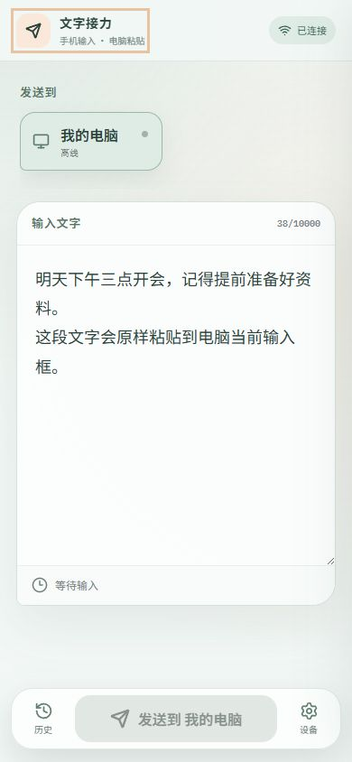

# Voice Relay

[简体中文](README.md) · [Changelog](CHANGELOG.md) · [Security](SECURITY.md) · [Contributing](CONTRIBUTING.md)

Voice Relay sends text produced by your phone's system voice keyboard to a selected Windows PC, then pastes it into the currently focused text field.

`Mobile PWA → your HTTPS reverse proxy → relay server → Windows tray client → Unicode clipboard + Ctrl+V`



## Highlights

- Installable mobile PWA; no native mobile app is required.
- Multiple Windows devices with online, offline, and paused presence.
- Curve25519 sealed-box encryption for every message; the server stores no messages.
- Per-user Windows tray app with optional startup-at-login.
- Preserves Unicode plain text, including emoji, tabs, and line breaks; it never presses Enter.
- Single-account self-hosting with optional standards-based TOTP.
- The application only exposes an internal HTTP port and does not manage ports 80/443, TLS certificates, or your reverse proxy.

## Quick start

Requirements: Linux, Docker Compose v2, and an HTTPS reverse proxy you operate.

```bash
mkdir voice-relay && cd voice-relay
curl -LO https://raw.githubusercontent.com/fangxinbuzaijia/voice-relay/main/docker-compose.yml
docker compose up -d
docker compose exec relay cat /data/initial-credentials.txt
```

The service binds to `127.0.0.1:3100` by default. On first boot it creates `/data/master.key` and a single account whose username and password are random eight-character alphanumeric strings. Change both after signing in. TOTP is disabled by default.

Your proxy must forward `/`, `/api/v1/*`, `/ws`, and the health endpoints to `127.0.0.1:3100`, preserving the external Host and WebSocket Upgrade headers. Public access requires a valid HTTPS certificate. See [reverse proxy guidance](docs/reverse-proxy.md).

## Windows client

Download the x64 installer or portable ZIP from [GitHub Releases](https://github.com/fangxinbuzaijia/voice-relay/releases). Closing its window keeps it in the notification area; use the tray menu to pause, configure startup, or exit.

## Update

```bash
docker compose pull
docker compose up -d
```

Back up the complete `data` directory while the service is stopped. The SQLite database, WAL files, and `master.key` belong together.

## Build from source

```bash
pnpm install
pnpm typecheck
pnpm test
pnpm build
docker compose -f docker-compose.yml -f docker-compose.build.yml up -d --build
```

The Windows client requires the .NET 10 SDK. Version tags matching `v*` publish multi-architecture images to GHCR and attach the Windows installer and portable ZIP to a GitHub Release.

## License

[MIT](LICENSE)

